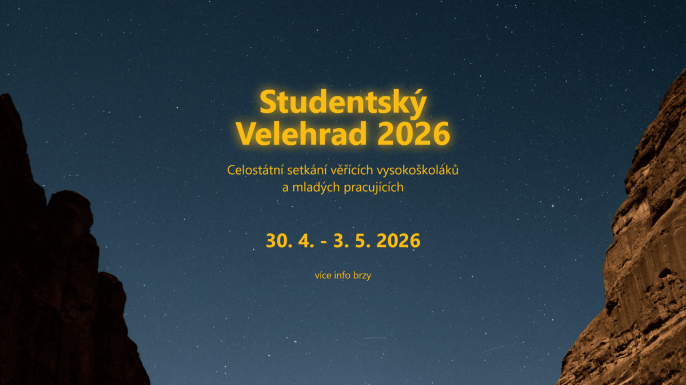

# Studentský Velehrad

Studentský Velehrad je celostátní setkání věřících vysokoškoláků a mladých pracujících na poutním místě Velehrad.

## 📅 Datum konání
**30. 4. - 3. 5. 2026**

## 🌍 Web
[studentskyvelehrad.cz](https://studentskyvelehrad.cz/)

## 📷 Sociální sítě
- [Facebook](https://www.facebook.com/studentskyvelehrad/)
- [Instagram](https://www.instagram.com/studentsky_velehrad/)
- [YouTube](https://www.youtube.com/channel/UCBf-XP-0GacYV8bqpvq1dSw)

## 📩 Kontakt
Pro dotazy a informace pište na: [studentskyvelehrad@vkhcr.org](mailto:studentskyvelehrad@vkhcr.org)

## 🚀 Technologie
Tento projekt je vytvořen pomocí:
- HTML
- CSS (Tailwind CSS)
- Cloudflare Pages

## 🏗 Struktura projektu
- `index.html` - Hlavní webová stránka
- `/favicon/` - Ikony pro různé platformy
- `/img/` - Obrázky používané na webu
- `/_astro/` - Vygenerované CSS styly

## 📜 Licence
Tento projekt je open-source a je k dispozici pod licencí **MIT**.

---

Připojte se k nám na Studentském Velehradě 2026! 🎉
